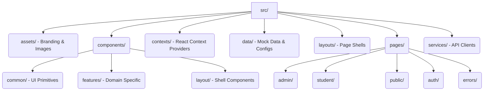

# REAL.i — Advanced Cognitive Learning Platform


**REAL.i** is a next-generation AI-powered educational platform engineered to provide a premium, cyber-industrial learning experience. The frontend is built for extreme performance and aesthetics using React 19, Vite, Tailwind CSS v4, and GSAP for fluid, cinematic animations.

---

## ✨ Key Features
- **Cyber-Industrial Aesthetics**: A completely custom UI featuring glassmorphism (`glass-card`), neon data streams, and hardware-accelerated GSAP animations.
- **AI Agents**: Meet the Admin, Student, and Friend agents — all integrated to assist users based on their roles.
- **Dynamic Routing**: Role-based access control (`/admin`, `/student`) with protected routes.
- **Responsive Architecture**: Fully optimized for mobile, tablet, and desktop with zero layout shift during animations.

---

## 🚀 Getting Started

### Prerequisites
- Node.js (v18+)
- npm (v9+)

### Installation

1. **Clone the repository and navigate to the project directory:**
   ```bash
   git clone <repository_url>
   cd Real_i-FrontEnd
   ```

2. **Install all dependencies:**
   ```bash
   npm install
   ```

3. **Environment Setup:**
   Copy the example environment variables file and configure it as needed.
   ```bash
   cp .env.example .env
   ```

4. **Start the Development Server:**
   ```bash
   npm run dev
   ```
   The application will be running on [http://localhost:5173](http://localhost:5173).

---

## 🏗️ Architecture Overview

The frontend follows a highly modular, feature-based architecture utilizing path aliasing (`@/` maps to `src/`).



---

## 🛠️ Available Scripts

- `npm run dev`: Boot up the Vite dev server with Hot Module Replacement (HMR).
- `npm run build`: Compile the application for production (outputs to `/dist`).
- `npm run preview`: Preview the compiled production build locally.
- `npm run lint`: Run ESLint across all `.jsx` and `.js` files to ensure code quality.

---

## 🎨 Design System
Our design system is powered by Tailwind CSS and extended via custom tokens in `index.css`:
- **Primary Color:** Gold/Yellow palette (`#d4af37`) heavily utilized for neon glows.
- **Surface Colors:** Deep, dark cyber-industrial backgrounds (`surface-950`, `surface-900`).
- **Typography:** `Inter` for data/UI text, `Outfit` for headings, `JetBrains Mono` for technical terminal accents.

> **Note on Animations:** 
> Do not use CSS shadows or expensive filters in GSAP animations. Always prefer `opacity` and `transform` (`x`, `y`, `scale`) to leverage GPU compositing.
